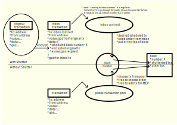

# Shutter Shop-SDK

Custom ethersjs Provider for Shutter on Optimism.

## Introduction

`shop-sdk` is a custom [`ethersjs`](https://docs.ethers.org/v5/api/providers/) provider, that
allows to send shutter encrypted ("shutterized") transactions on Shutter-Optimism.

Shutter-Optimism is an [Optimism](https://www.optimism.io/) testnet, that provides a mechanism to
include Shutter encrypted transactions.

[Shutter](http://shutter.network/) is a distributed key generation (DKG) threshold encryption
protocol, that enables applications and/or users to encrypt arbitrary data, _commit_ the encrypted
message (i.e. by sending it in a transaction) and have it _revealed_ after a certain condition is
met (i.e. once the position of the transaction in a future block is confirmed). Shutter's
threshold decryption scheme, where a threshold of `n` out of `m` key holders ("keypers") need to
release their decryption key share for successful reveal, enables an environment where _censorship_,
by not releasing decryption keys, and _collusion_, by peeking into encrypted messages before the
reveal condition was reached, become very unlikely.

In Shutter-Optimism this allows to build
[MEV](https://ethereum.org/en/developers/docs/mev/)-resistant applications.

The intention of `shop-sdk` is to make it as easy as possible to transform a traditional
application, that could run on Optimism, into a MEV protected version running on Shutter-Optimism.

## Getting Started

### Install

```
npm install @shutter-network/shop-sdk
```

### Build from source

```
npm run build
```

### Architecture

This section covers some behind-the-scenes on how Shutter-Optimism works. While it can be beneficial
to understand the background, if you're eager to get started, you can jump down to [Usage](#Usage) and
come back here later.

#### Overview

Here is a general overview, for the tx-flow on Shutter-Optimism:



#### Details

`shop-sdk` makes use of the Shutter WASM library, a WebAssembly of Shutter's cryptography
[library `shlib`](https://pkg.go.dev/github.com/shutter-network/shutter/shlib@v0.1.18/shcrypto).

The general crypto scheme is based on an _eon_ public/private key pair, that is created during the
initialization of a keyper set, and _epoch_ keys. For
[encryption](https://pkg.go.dev/github.com/shutter-network/shutter/shlib@v0.1.18/shcrypto#Encrypt)
only the _eon public key_, an _epoch identifier_ and some random input (`sigma`) are needed.
The `eon public key` is
[published](https://github.com/shutter-network/shop-contracts/blob/main/src/KeyBroadcastContract.sol)
through a smart contract and can be used as long as the same keyper set stays active.

[Decryption](https://pkg.go.dev/github.com/shutter-network/shutter/shlib@v0.1.18/shcrypto#EncryptedMessage.Decrypt)
of messages encrypted with the above scheme requires an `epoch secret key`, that is created
collaboratively by the keyper set, based on a certain `epoch identifier`.

The SDK allows to develop browser applications, that can encrypt transactions and submit them to
the Shutter-Optimism
[`Inbox` contract](https://github.com/shutter-network/shop-contracts/blob/main/src/Inbox.sol). The
`Inbox` accepts encrypted transactions with the following signature:

```solidity
    function submitEncryptedTransaction(
        uint64 blockNumber,
        bytes memory encryptedTransaction,
        uint64 gasLimit,
        address excessFeeRecipient
    ) external payable whenNotPaused {...
```

Here we can see, that an `encryptedTransaction` is scheduled for a certain `blockNumber` in the
future, with a specified `gasLimit` for the execution of the decrypted transaction and an
address for the `excessFeeRecipient`. The `gas` for execution needs to be provided as `msg.value`
at submission time (hence the `payable` signature). The `Inbox` will check the general sanity
(availability of funds for gas, gas limits for the block, ...) and enqueue the (still) encrypted
transaction in an internal data structure for the scheduled block.

Shutter-Optimism employs a [fork of `op-geth`](https://github.com/shutter-network/op-geth), that
has special rules for the state transition function, that require to include the enqueued Inbox
transactions at the top of the scheduled block.

At block building time, the shutter keypers will produce an `eon secret key` for the next
`epoch identifier`, which, in the case of Shutter-Optimism is based on the block number. The
secret key is shared with the block builder. All enqueued transactions for this block will now be
decrypted and regularily executed, in the order specified in `Inbox`.

A _shutterized_ block will contain a shutter specific [EVM log
message](https://github.com/shutter-network/op-geth/blob/shutter/core/shutter.go), that will
publish the _epoch secret key_, as well as the decryption and execution status for the shutterized
transactions:

```go
type RevealRecord struct {
	DecryptionKey      []byte
	TransactionRecords []RevealedTransactionRecord
}

type RevealedTransactionRecord struct {
	Status            uint64
	CumulativeGasUsed uint64
	CumulativeLogs    uint64
}

const (
	RevealedTransactionRecordStatusSuccess          = 0x64
	RevealedTransactionRecordStatusDecryptionFailed = 0x65
	RevealedTransactionRecordStatusExecutionFailed  = 0x66
)
```

By definition, the `RevealRecord` will be in log position `0` of the shutterized block.

### Usage

Usage is very similar to that of a vanilla `ethers` `BrowserProvider`. If you're not familiar with
it yet, you should [read the documentation](https://docs.ethers.org/v5/api/providers/).

The following is an annotated version of the example in `example/browserwallet.ts`.

#### Import

```js
import {
  ShutterProvider,
  ethers,
  init,
  decrypt,
} from '@shutter-network/shop-sdk'
```

#### Chain specific parameters

```js
// shutter specific constants
const options = {
  // path to the WASM library
  wasmUrl: '/shutter-crypto.wasm',
  // contract address to query the current keyper set
  keyperSetManagerAddress: '0x4200000000000000000000000000000000000067',
  // target address for encrypted transactions
  inboxAddress: '0x4200000000000000000000000000000000000066',
  // contract address to query encryption keys
  keyBroadcastAddress: '0x4200000000000000000000000000000000000068',
}
```

In the case of Shutter Optimism, the contract addresses are "predeployed" at fixed addresses. So
you don't have to expect these to change.

#### Initialize WASM

In order for the WebAssembly to become available, it needs to be initialized. This is achieved by
the `init()` method:

```js
// initialize shutter WASM library
await init(options.wasmUrl)
```

Note, that the `.wasm` file needs to be accessible for the browser, so usually it is a good idea
to bundle it with other `assets` of your application.

#### Provider / Signer

The following is almost a copy & paste of the
[original ethers documentation](https://docs.ethers.org/v6/getting-started/#starting-connecting).
Pay attention to the creation of the `ShutterProvider` - you need to pass the `options` created
earlier.

```js
let signer = null

let provider
if (window.ethereum == null) {
  // If MetaMask is not installed, we use the default provider,
  // which is backed by a variety of third-party services (such
  // as INFURA). They do not have private keys installed,
  // so they only have read-only access
  console.log('MetaMask not installed; using read-only defaults')
  provider = ethers.getDefaultProvider()
} else {
  // Connect to the MetaMask EIP-1193 object. This is a standard
  // protocol that allows Ethers access to make all read-only
  // requests through MetaMask.
  // SHUTTER> use ShutterProvider
  provider = new ShutterProvider(options, window.ethereum)

  // It also provides an opportunity to request access to write
  // operations, which will be performed by the private key
  // that MetaMask manages for the user.
  signer = await provider.getSigner()
}
```

#### Encrypt a transaction

Sending an encrypted transaction can now be achieved through the standard interface,
`signer.sendTransaction()`. This will trigger the usual signature request in the wallet plugin.

```js
// transaction parameters
let txRequest = {
  from: signer.address,
  to: signer.address,
  value: 1,
  data: '0x',
}

// send transaction with standard settings
const txResponse = await signer.sendTransaction(txRequest)

// wait for the inboxTransaction to be mined:
await txResponse.wait()
```

**IMPORTANT**: The transaction presented in the confirmation dialog will be different from the
content specified in `txRequest`. This is due to the request being encrypted and sent to the
`Inbox` contract. You will need to communicate to your users what is happening!

ShutterSigner will automatically

- query the encryption parameters
- schedule an execution block based on the `inclusionWindow` parameter (default: `25`)
  `scheduledExecutionBlock = latestBlock + inclusionWindow`
- encrypt the original transaction
- estimate the necessary gas
- prepare a transaction to the `Inbox` contract
- trigger the user interaction for signing

**IMPORTANT**: if the user does not sign the transaction in time to be included
before `scheduledExecutionBlock`, the transaction **will** fail.

#### Tracing the encrypted transaction submission

In order to present more status to the user (i.e. time to execution, encrypted message, ...),
there is also a more comprehensive function to send transactions, `signer._sendTransactionTrace()`:

```js
const inclusionWindow = 25 // default inclusionWindow
const [encryptedMessage, txResponse, scheduledExecutionBlock] =
  await signer._sendTransactionTrace(txRequest, inclusionWindow)
```

#### Inspecting shutterized blocks

Finally some example, how to inspect the execution results:

```js
// wait for the execution block, then check the result:
let blockdata = await provider.getBlock(scheduledExecutionBlock, true)
let txHash = blockdata.getPrefetchedTransaction(0).hash
let receipt = await provider.getTransactionReceipt(txHash)
let executionLog = receipt.logs[receipt.logs.length - 1].data

// the executionLog contains the decryptionKey
let [decryptionKey, executions] = ethers.decodeRlp(executionLog)

// check that the included transaction corresponds to txRequest
let decrypted = await decrypt(
  Uint8Array.from(Buffer.from(encryptedMessage, 'hex')),
  Uint8Array.from(Buffer.from(decryptionKey.slice(2), 'hex')),
)
const [to, data, value] = ethers.decodeRlp(
  '0x' + Buffer.from(decrypted.slice(1)).toString('hex'),
)
console.log([
  txRequest.to == to,
  txRequest.data == data,
  txRequest.value == parseInt(value, 16),
])

// executions contains an array with status information for all shutterized transactions
// in the block

executions.map(execution => {
  let [status, gasUsed, logNumber] = execution
  let success = status == '0x64'
  console.log(
    `${logNumber} successful: ${success} (${status}) gas used ${gasUsed}`,
  )
})
```

## Deployment Information

### Chain Parameters for MetaMask

```js
const shopChain = {
  chainId: '0x281b6fc',
  chainName: 'SHOP',
  rpcUrls: ['https://rpc.op-sepolia.shutter.network'],
  iconUrls: ['https://demo.op-sepolia.shutter.network/icon-192.png'],
  nativeCurrency: {
    name: 'SHOPeth',
    symbol: 'SHOP',
    decimals: 18,
  },
  blockExplorerUrls: null,
}
```

### Current Deployment Addresses

```json
{
  "AddressManager": "0x970Bf4b5F6493292361c6cC763eE62960e7A2F3E",
  "L1CrossDomainMessenger": "0x5537c3D815bc9cD37B1c5758D51EA6a109f599Fc",
  "L1CrossDomainMessengerProxy": "0xb1044b939e73631F4AF646c9782B9D7d20a83A58",
  "L1ERC721Bridge": "0x51300e790366e7Fe2C592EB1DF4Ea35F4aD6B8aD",
  "L1ERC721BridgeProxy": "0x6955D9c433E8cA3c8eDEFC635774eDbE1b2c953D",
  "L1StandardBridge": "0x5F298AD62b4caf8481E6d259902CD4446C814C59",
  "L1StandardBridgeProxy": "0xC98Cdf523091100e4F83389EB93385071Ca349B9",
  "L2OutputOracle": "0x89427E9D5EFD08CFA1db80450c78aB881a8Ee629",
  "L2OutputOracleProxy": "0x62bd32753EB813617aAa44375ed870e38207a418",
  "OptimismMintableERC20Factory": "0xe8e2603c73a31c6D1C8468d1623b7e3945eB81fD",
  "OptimismMintableERC20FactoryProxy": "0x462F3cCBCafcDA1fAA6711813f4A60ed248Fe788",
  "OptimismPortal": "0x387BdFFbcc4f5cE54e68025c2Ebfcaa5e6CB9976",
  "OptimismPortalProxy": "0x75d931B9F7aEE5E1D0635E9d98020303F2B85110",
  "ProtocolVersions": "0x9E0720bd0f5ac9176D15a3F5395128fDA3fc90E3",
  "ProtocolVersionsProxy": "0xE62c33DA07A6209c819E8406Ba454Eba58aE6C79",
  "ProxyAdmin": "0x9133006a6B5F5f01E5E51FCA8D55a1fd6795c6A4",
  "SafeProxyFactory": "0xa6B71E26C5e0845f74c812102Ca7114b6a896AB2",
  "SafeSingleton": "0xd9Db270c1B5E3Bd161E8c8503c55cEABeE709552",
  "SystemConfig": "0x217c9a125cf36e0912Dc2C0A8f414da9E41e0A33",
  "SystemConfigProxy": "0x78942913Dd67a4bE57e382A5C5DBA2a0ee821F7c",
  "SystemOwnerSafe": "0xafB5230168994606BBaB66798B4361A051E4068F"
}
```
